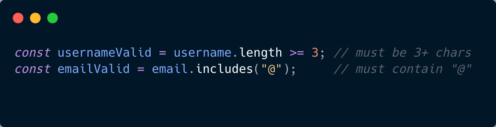
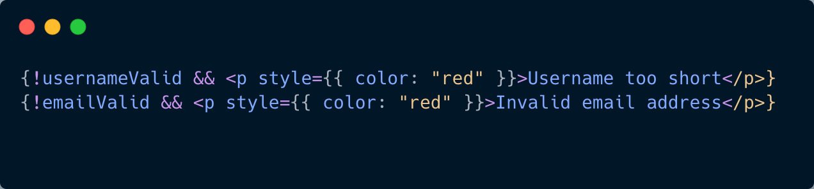
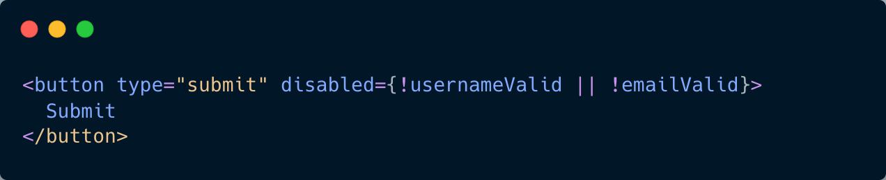
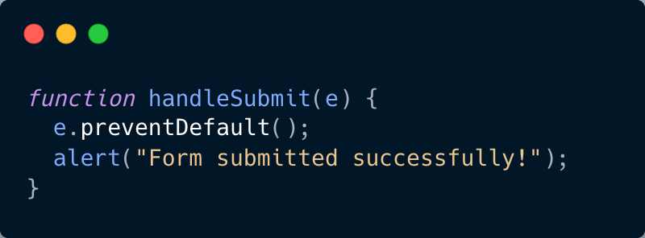
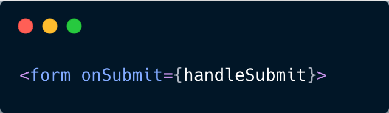
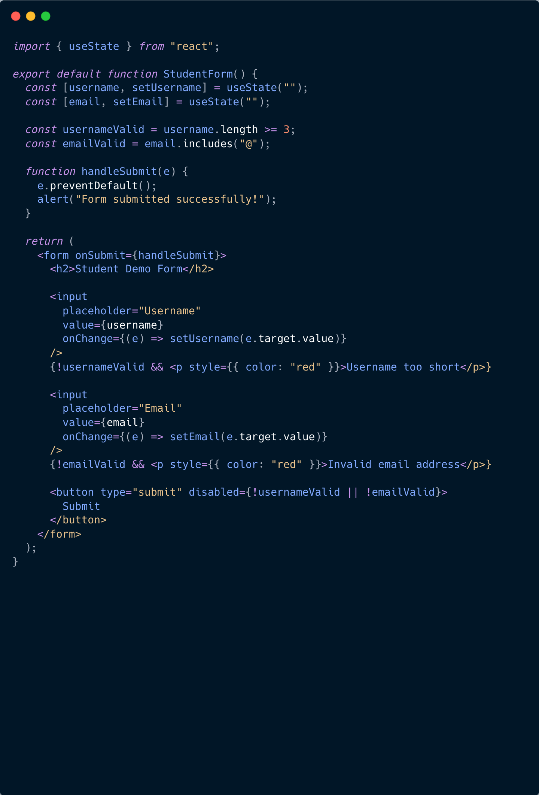

# React Form Validation Tutorial  
A Beginner-Friendly Guide for Students

Welcome!  
In this tutorial, you will learn how to:

- Create controlled inputs in React  
- Validate user input with simple rules  
- Display error messages  
- Disable/enable the submit button based on validity  
- Handle form submission without refreshing the page  

This tutorial follows the same steps we used in class and is perfect for beginners.

---

## 1. Starter Code

Create a component called **`StudentForm.jsx`** and begin with this:

```jsx
import { useState } from "react";

export default function StudentForm() {
  const [username, setUsername] = useState("");
  const [email, setEmail] = useState("");

  return (
    <form>
      <h2>Student Demo Form</h2>
    </form>
  );
}
```


# Add Two Controlled Inputs


## Add Simple Validation Rules

We will validate:
	•	Username must be 3+ characters
	•	Email must contain “@”

Add these inside your component:



## Show Helpful Error Messages

We display an error only when the rule is broken.




## Disable the Submit Button Until Valid

The button becomes enabled only when all rules pass.



## Handle Form Submission

React prevents page refresh and lets you control what happens.

form submission




Attach it to the form:




### Final Complete Code



